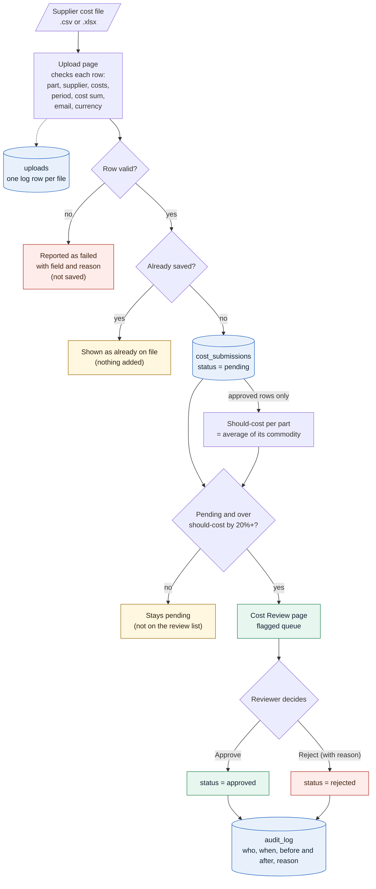

# NorthPeak Components: Supplier Cost Tool

A small tool that replaces part of the manual "open each supplier file and copy numbers into a
spreadsheet" process: a validated bulk-upload pipeline, a cost-review screen with an audit trail,
and a one-line risk note per supplier. All data is fictional. The requirements come from the case-study brief.

## Run it

Needs Python 3.9+ and Node 20+ (Node is only needed to build the React frontend).

```bash
# 1. Create and activate a virtual environment, then install the Python packages
python3 -m venv .venv
source .venv/bin/activate                    # Windows: .venv\Scripts\activate
pip install -r requirements.txt

# 2. Build the frontend (needs Node 20+; see below if you don't have it)
cd frontend && npm install && npm run build && cd ..

# 3. Start the app
python -m src serve                          # http://127.0.0.1:5000  (API + built React app)
```

Activate the environment (`source .venv/bin/activate`) in every new terminal before running `python`,
`pip` or `npm` commands from this README; the commands below assume it is active. Without activating,
`python` is the system Python, which does not have the packages installed. (Alternatively, call
`.venv/bin/python` and `.venv/bin/pytest` directly.) Type `deactivate` to leave the environment.

**No Node installed?** This puts Node and npm inside the virtual environment (no admin rights, no global
install). Run it after step 1, then continue with step 2:

```bash
pip install nodeenv && nodeenv -p --node=22.11.0
```

The SQLite database (`northpeak.db`) is created and seeded from `data/` on first start
(20 suppliers, 28 facilities, 45 parts, 250 historical submissions, 15 risk events, plus computed
should-costs). `python -m src init --reset` rebuilds it from scratch; `python -m src init --reset --empty`
creates the tables with no data at all. Seeding happens only when the database file is brand new, so an
emptied database stays empty across restarts. Note that an empty database has no parts or suppliers, so
every uploaded row fails validation until the master data is loaded.

**Frontend development** (hot reload): run `python -m src serve` in one terminal and
`cd frontend && npm run dev` in another, then open http://localhost:5173 (Vite proxies `/api`
to port 5000).

**UI** (React + TypeScript + Vite, in `frontend/`)

| Page | What it does |
|---|---|
| `/upload` | Upload a `.csv` or `.xlsx`; shows the per-row validation report using the file's own column names, with each failing cell highlighted and the reason stated in it. Click a header to sort, and use the filter box under each column (e.g. `result` = `=failed`, `submitted_unit_cost` `>5`) |
| `/review` | Flagged submissions with Approve / Reject; click a column header to sort (default: largest `pct_over` first) and use the filter box under every column (same rules as the data tables; combine several); set "Working as" (top right) first |
| `/data` | Read-only browser for all tables: a filter box under every column header (combine several; all must match), global search, sort, paging; suppliers include the risk note |

**Sticky header** (toggle in the top bar, on by default): in every table, the column headings and filter boxes stay pinned while
the rows scroll (the table scrolls inside its own box; in the split-view panels the search box and summary stay in view too).
Turn it off and tables simply grow with their rows. The choice is remembered.

**Split view** (toggle in the header, on by default): the current page (Upload or Review) on the left and,
on the right, two stacked data tables with a draggable divider between them.

- Each table has its own picker, column filters, search, sort and paging.
- **The bottom table follows the top one.** Filter the top table (say `parts` where `commodity` is
  `=Connector`) and the bottom (say `cost_submissions`) shows only the records related to those rows.
  Click a row in the top table to narrow the bottom to just that row's related records; click again to clear.
  Untick "follow top table" for an independent bottom table, or "hide" to drop it.
- Relations come from the schema's keys: suppliers to facilities, cost_submissions, parts and
  (through those) risk_events; parts to cost_submissions and should_cost_estimates; facilities to
  risk_events; cost_submissions to audit_log; uploads to cost_submissions (by file name). Links work in
  both directions and follow at most two steps, so e.g. suppliers to risk_events goes via facilities.
  Tables with no such link (say parts and risk_events) show a "Not linked" note.
- After an upload the top table jumps to `cost_submissions` (newest first); after an approve/reject to
  `audit_log`. Both panes refresh after every change. Below 900px wide the panel stacks underneath.

The backend is a JSON API (`/api/upload`, `/api/review`, `/api/tables`); interactive docs at `/api/docs`.

**Column filters:** all filters must match. On text columns, plain text = contains (case-insensitive), `=text`
exact, `!=text` not equal. On number columns (ids, costs, percentages) a plain number means *equals*: `5` finds 5
(and 5.0) but not 25 or 5.5; `=5` and `!=5` also compare as numbers; `>5`, `>=5`, `<5`, `<=5` compare too. Text
typed in a number column falls back to the text rules. Filters apply after a short pause in typing, or straight
away on Enter. The UI has one box per column; the API (`GET /api/tables/{table}?f=column:value&f=...`) also accepts
several filters on the same column, e.g. `f=submitted_unit_cost:>=5&f=submitted_unit_cost:<=6`.

**CLI** (same pipeline, no browser)

```bash
python -m src upload data/bulk_upload_sample_with_errors.csv
python -m src recompute      # rebuild should_cost_estimates
```

## Data

### Provided files (`data/`)

| File | Rows | Columns | Used for |
|---|---|---|---|
| `suppliers.csv` | 20 | `supplier_id`, `name`, `region`, `tier`, `risk_rating`, `created_at` | Supplier master list (14 APAC, 4 EMEA, 2 Americas). |
| `facilities.csv` | 28 | `facility_id`, `supplier_id`, `name`, `country`, `latitude`, `longitude`, `facility_type` | Where each supplier's factories and warehouses are; feeds the risk notes. |
| `parts.csv` | 45 | `part_id`, `part_number`, `description`, `commodity`, `uom`, `target_cost` | Part master list across 7 commodities (Battery Cell 11, Enclosure 10, Connector 8, Sensor Module 7, Camera Module 5, RF Antenna 3, PCB Assembly 1). `target_cost` is not used for should-cost. |
| `cost_submissions.csv` | 250 | `submission_id`, `part_id`, `supplier_id`, `fiscal_period`, `submitted_unit_cost`, `material_cost`, `labor_cost`, `overhead_cost`, `margin_pct`, `currency`, `submitted_by`, `submitted_at`, `status`, `source_file` | Historical submissions that seed the database: periods FY26-Q1 to FY26-Q3, all USD, 171 approved / 52 pending / 27 rejected. |
| `risk_events.csv` | 15 | `event_id`, `facility_id`, `event_type`, `severity`, `event_date`, `description`, `status` | Earthquake, typhoon, flood, labor strike and single-source events tied to a facility (2 open, 5 monitoring, 8 resolved). |
| `bulk_upload_template.csv` | 8 | the upload columns below | A clean upload file (FY26-Q4). |
| `bulk_upload_sample_with_errors.csv` | 8 | the upload columns below | The same shape with 5 deliberately broken rows and 3 valid ones (see "Why each bad row ... is caught"). |
| `generate_dummy_data.py` | | | The generator behind all of the above; see "Test data" for making extra upload files. |

### Upload file format

A `.csv` or `.xlsx` (first sheet) with these ten columns, all required:

| Column | Rule |
|---|---|
| `part_number` | Must exist in `parts`. |
| `supplier_name` | Must exist in `suppliers` (matched ignoring case). |
| `fiscal_period` | Format `FY##-Q1` to `FY##-Q4`, e.g. `FY26-Q4`. |
| `submitted_unit_cost` | Positive number; must equal `material_cost` + `labor_cost` + `overhead_cost` (within 0.005). |
| `material_cost`, `labor_cost`, `overhead_cost` | Positive numbers. |
| `margin_pct` | A number from 0 up to (not including) 100. |
| `currency` | `USD` only. |
| `submitted_by` | A valid email address. |

Uploads identify parts and suppliers by name; the database stores their ids.

### Database tables

| Table | Holds | Comes from |
|---|---|---|
| `suppliers`, `facilities`, `parts`, `risk_events` | Master data | The CSV files above, loaded once; the app only reads them. |
| `cost_submissions` | Raw costs as submitted, with a `status` of pending, approved or rejected | The 250 seed rows plus every valid uploaded row (`source_file` says which file). |
| `should_cost_estimates` | The calculated should-cost, one row per part, kept separate from submissions | Calculated by the tool. |
| `audit_log` | One row per approve or reject decision; cannot be edited or deleted | Written by the Cost Review screen. |
| `uploads` | One row per uploaded file: name, hash, time, uploader, row counts and the validation report | Written by the upload pipeline. |

### Things to know about the data

- `parts` has no `supplier_id`, and there is no supplier-to-part table. The link between a supplier and a part exists only through `cost_submissions`, so any supplier can submit any part.
- The seed statuses were assigned at random, independent of price, so some approved rows are well above their should-cost. Likewise `fiscal_period` was chosen independently of `submitted_at`, so the two often disagree.
- The seed data has 34 cases of the same part, supplier and period submitted more than once with different costs. These are treated as legitimate resubmissions.
- Commodities are uneven: `PCB Assembly` has a single part, so its should-cost comes from one part's history.

## Test data

Extra upload test data, a file mixing valid and invalid rows, can be generated with the provided script
without touching the other data files: `python data/generate_dummy_data.py --bulk-test 100` writes
`data/bulk_upload_test_100.csv` (use any row count in place of 100). Running the script with no arguments
regenerates every CSV in `data/` instead.

## Tests

```bash
python -m pytest -q                          # backend (pytest)
cd frontend && npm test                      # frontend (Vitest + Testing Library)
```

Every backend test runs against its own temporary database (see `tests/conftest.py`, which provides the
`conn` fixture, a freshly seeded database, and the `app` fixture, a FastAPI app on its own database), so
the tests never touch `northpeak.db`. Several tests use the real files in `data/`, so counts such as
250 submissions or the results for the two sample upload files assume those files are unchanged.
The frontend tests are next to the code they test in `frontend/src/` (upload report, review page, data tables,
split view, filter rules).

### `tests/test_upload.py`: the upload pipeline and the database

| Test | What it checks |
|---|---|
| `test_seed_loaded` | A fresh database has the provided data: 250 submissions, 20 suppliers, 45 parts, 28 facilities, 15 risk events. |
| `test_clean_template_accepts_all_rows` | `bulk_upload_template.csv` saves all 8 rows with no errors. |
| `test_error_file_rejects_exactly_the_five_broken_rows` | In `bulk_upload_sample_with_errors.csv`, rows 1 to 5 fail on the expected fields (unknown part and supplier, negative costs, blank cost, blank submitter, bad period), rows 6 to 8 are saved, and only those 3 rows reach the database. |
| `test_reupload_is_idempotent` | Uploading the same file twice saves nothing the second time: 8 rows "already on file", totals unchanged, and the report notes the file was seen before. |
| `test_overlapping_files_do_not_double_count` | Uploading the template and then the error file: the 3 rows the files share are recognised as duplicates. |
| `test_same_key_different_cost_saved_with_warning` | The same part, supplier and period with different costs is saved as a new row, with a warning. |
| `test_excel_gives_same_result_as_csv` (2 cases) | An `.xlsx` copy of each sample file gives the same row-by-row result as the CSV, and its rows are recognised as already on file. |
| `test_unprocessable_files_give_clear_error` (5 cases) | A `.xls` file, a `.txt` file, an empty file, a file missing required columns and a corrupt `.xlsx` each fail with a clear message and record nothing. |
| `test_empty_database_is_not_reseeded_on_next_start` | A database created empty stays empty on the next start; with no master data every uploaded row fails. |
| `test_existing_database_is_not_reseeded` | A database whose master tables were emptied is not refilled at startup. |
| `test_identical_row_is_blocked_by_the_database_itself` | Inserting an identical row (also with the email in a different case) fails on the database's unique index, not just in the code. |

### `tests/test_review.py`: should-cost, the review queue, the audit log and risk notes

| Test | What it checks |
|---|---|
| `test_should_cost_is_separate_and_does_not_touch_submissions` | Recomputing estimates leaves `cost_submissions` byte-for-byte unchanged and writes 45 estimate rows. |
| `test_should_cost_is_the_commodity_average_of_approved_submissions` | Every part in a commodity gets the same estimate: the mean unit cost of that commodity's approved submissions, with the sample size recorded. |
| `test_pending_and_rejected_submissions_do_not_change_the_estimate` | Multiplying the costs of pending and rejected submissions by 10 does not change any estimate. |
| `test_commodity_without_approved_history_gets_no_estimate` | If a commodity has no approved submissions, its parts get no estimate (and only those). |
| `test_flagged_rows_are_all_above_threshold_and_pending` | The review queue holds only pending rows above the threshold, worst first; a stricter threshold gives fewer. |
| `test_decision_is_logged_with_before_and_after` | Approving a row updates its status and writes one audit row (who, when, before and after status, cost, should-cost, % over); the row leaves the queue. |
| `test_repeated_decisions_append_rows` | Approving and then rejecting the same row leaves two audit rows, not one overwritten. |
| `test_audit_log_is_append_only` | Updating or deleting an audit row is rejected by the database. |
| `test_invalid_decisions_change_nothing` (3 cases) | No name, a reject without a reason, and an unknown action are all refused: no audit row and the status is unchanged. |
| `test_unknown_submission` | Deciding on a submission id that does not exist gives an error. |
| `test_uploaded_expensive_row_shows_up_for_review` | An uploaded row priced at twice its should-cost is saved as pending and appears in the review queue. |
| `test_risk_notes_cover_every_supplier` | All 20 suppliers get a risk note, including "open risk event" and "only supplier for" notes. |
| `test_review_queue_lists_only_pending_rows_even_though_approved_ones_can_be_over_threshold` | The seed data has approved and rejected rows above the threshold; the queue leaves them out and lists every pending one above it. |

### `tests/test_web.py`: the JSON API

| Test | What it checks |
|---|---|
| `test_upload_returns_row_level_report` | Uploading the error file returns 3 saved and 5 failed; the first row's errors name `part_number` and `supplier_name`, and each row's values follow the file's column order. |
| `test_upload_rejects_bad_file_type` | A `.pdf` upload gets a clear "Unsupported file type" error. |
| `test_upload_without_file` | An upload with no file is refused. |
| `test_review_list_and_decision_flow` | The review list has the threshold, risk notes and % over; a decision without a name is refused; with a name it moves pending to approved, the row leaves the queue and the audit log shows the actor. |
| `test_reject_needs_reason` | A reject without a reason is refused. |
| `test_every_table_is_browsable` | The table list has all 8 tables with correct counts; each one loads; suppliers include the `risk_note` column. |
| `test_table_paging_sorting_search` | Paging, sorting and search work; an invalid sort column is ignored; an unknown table gives 404. |
| `test_serves_built_frontend_with_spa_fallback` | `/` and `/review` return the app page, assets are served, a missing asset gives 404, unknown `/api` paths give a JSON 404, and path tricks do not read other files. |
| `test_multiple_column_filters_are_anded` | Filters on several columns all have to match; the applied filters are echoed back. |
| `test_filters_combine_with_search_and_paging` | Column filters and the global search apply together. |
| `test_filter_operators` | `>`, `>=` and `<=` ranges, `=` exact (case-insensitive), `!=`, and plain contains. |
| `test_filter_edge_cases` | `%` is taken literally, blank filters are ignored, and an unknown column, a SQL-injection-style column name, a bad number or a hidden column gives 400. |
| `test_linked_table_follows_the_top_tables_filters` | Filtering `parts` to one commodity limits the linked `cost_submissions` and `should_cost_estimates` to those parts. |
| `test_link_works_in_both_directions_and_narrows_to_one_row` | Links work parent to child and child to parent, and one selected row narrows the other table to its related rows. |
| `test_link_follows_chains_of_relations` | A link can go through a middle table (suppliers, facilities, risk events; suppliers, submissions, parts). |
| `test_link_combines_with_the_bottoms_own_filters_and_search` | A linked table's own filters and search still apply on top of the link. |
| `test_link_between_unrelated_or_identical_tables_is_a_note_not_an_error` | Tables with no relation (or the same table) show a "Not linked" note and all their rows. |
| `test_link_upload_records_to_their_submissions_and_bad_link_params` | An upload record links to the submissions it created (by file name); bad link tables or columns give 400. |
| `test_plain_number_on_a_numeric_column_means_equals_not_contains` | `1` on `supplier_id` finds only supplier 1 (not 10 to 19); `!=1` excludes it; `0.434` finds one part and `0.43` finds none. |
| `test_numeric_filters_leave_text_columns_alone_and_fall_back_for_non_numbers` | Text columns keep "contains"; non-numeric text in a number column matches nothing and does not crash. |

## How it works

```
schema/schema.sql   tables, constraints, append-only triggers
src/
  validation.py     per-row checks (all problems on a row are reported)
  ingest.py         CSV/Excel reader + process_upload(): validate, save valid rows, build report
  shouldcost.py     should-cost estimates -> should_cost_estimates
  review.py         flagging query + decide() (status change and audit row in one transaction)
  risk.py           one-line supplier risk notes
  browse.py         table filters and the relations used to link the two data tables
  web.py            FastAPI: JSON API under /api + serves frontend/dist
  cli.py            command line (init, upload, recompute, serve)
frontend/           React + TypeScript + Vite app (pages/: Upload, Review, Data)
```

## Why each bad row in `bulk_upload_sample_with_errors.csv` is caught

The pipeline saves the 3 valid rows and fails exactly these 5 (`row` is the data row number,
starting at 1 under the header):

| Row | What is wrong | Check that catches it |
|---|---|---|
| 1 | `SNS-9999` / `Unknown Supplier Co` | Part number not in `parts`, and supplier name not in `suppliers`. Both are reported. |
| 2 | `submitted_unit_cost = -1.2`, `overhead_cost = -1.9` | Costs must be positive numbers. Both fields are named. |
| 3 | `submitted_unit_cost` blank | Every column is required. |
| 4 | `submitted_by` blank | Required field. It also fails the cost-sum check (components add to 1.5, submitted 3.0), so two errors are shown. |
| 5 | `fiscal_period = NOT-A-PERIOD` | Must match `FY##-Q1..Q4`. |

Other checks: `margin_pct` numeric in [0, 100); currency USD; `submitted_by` a valid email; and
material + labor + overhead must equal the unit cost (within 0.005). The last one holds for all 250
seed rows and the template, and margin is not added on top.

## Decisions and why

The brief left these open; the choices are mine and easy to change.

| Area | Decision and why |
|---|---|
| **Upload: partial acceptance** | Valid rows are saved even when others fail, and every problem on a row is listed, so a file can be fixed in one pass. A file that cannot be read at all (wrong type, missing columns, empty) saves nothing. |
| **Upload: duplicates** | "Same" means identical row content, enforced by a unique index. Re-uploading a file, or another file with the same rows, saves nothing and shows "already on file". Not keyed on part + supplier + period, because the seed data already has 34 such repeats with different costs; a different-cost resubmission is saved as pending with a warning. |
| **Upload: new rows** | They enter as `pending`; approval happens only on the review screen. An uploaded row's `submitted_at` is the upload's UTC timestamp; seed rows keep their CSV dates. |
| **Upload: file types** | `.csv`, and `.xlsx` or `.xlsm` (first sheet). `.xls` is rejected with a clear message. |
| **Upload: suppliers and parts** | Any supplier may submit any part. The data has no supplier-to-part mapping to check against. |
| **Should-cost** | The mean approved unit cost of the part's commodity, as the brief suggests, kept in its own table with the sample size (shown as "commodity avg, n=16"). Pending rows are unvetted and rejected ones are known bad, so neither counts. Trade-off: parts within a commodity can differ in cost, so a pricier part may be over-flagged. A commodity with no approved history gets no estimate, so nothing is flagged. Per-part averages were tried and dropped as confusing. |
| **Flag threshold** | A submission is flagged when its unit cost is **more than 20% above its should-cost**: `(submitted_unit_cost / should_cost − 1) × 100 > 20`. The percentage can be updated by changing `NORTHPEAK_FLAG_PCT` in the config file (`src/config.py`). The brief only says "a lot higher", so 20% is my choice: seed prices range from 0.8x to 1.35x target, so 20% skips ordinary variation and catches the clear outliers. On the seed data it flags 8 of the 52 pending rows; 10% would flag 18 (too many to review) and 30% only 2 (it would miss real outliers). Only prices above should-cost are flagged, not unusually low ones. |
| **Review screen** | A queue of pending, flagged rows, worst first. A decided row leaves the list, and approved or rejected rows never appear, even above the threshold (the seed statuses are random). Pending rows within the threshold are not listed and stay pending. |
| **Audit log** | One row per decision (who, when, before and after status, reason, cost, should-cost, % over), written in the same transaction as the status change. Database triggers block edits and deletes, so it is append-only. A reason is required to reject and optional to approve. |
| **Who acted** | A name typed into the UI (kept in the browser), with no login. A blank name is refused. |
| **Risk note (optional, done)** | One line per supplier: open events with the highest severity, events being monitored, sole-source flag, and "only supplier for PART" (inferred from submission history). Shown on the review screen and the suppliers table. |
| **Database** | `schema/schema.sql` was not provided, so it is written from the table list, plus an `uploads` table (one row per file, with its hash and report). Schema constraints back up the validator. |
| **Frontend: stack** | A React + TypeScript (Vite) app served by the same FastAPI server, so there is one process to run. Node is only needed to build it. |
| **Frontend: filters and sort** | The data tables filter and page on the server, since they can be large. Cost Review and the upload report already hold all their rows, so they filter and sort in the browser with the same rules. |
| **Frontend: number filters** | On number columns a plain number means equals: `5` finds 5, not 25 or 35. |
| **Frontend: split view** | Two stacked tables on the right; the bottom one follows the top through the schema's keys (at most two steps), to show related records. |
| **Frontend: sticky header** | Column headings and filter boxes stay pinned while rows scroll, with a toggle to turn it off. |

## What I skipped

- Authentication and per-user permissions. The actor is self-declared, so the audit log records who *claims* to have acted.
- Revision handling: a resubmission with different numbers is saved alongside the old one, not
  linked as a "supersedes" chain.
- Currency conversion (USD only), and checks that a supplier actually makes a part.
- Fiscal-period window checks (format only), and an upper sanity bound on cost values.
- Editing or deleting submissions, and master-data screens (out of scope per the brief).
- Statistical robustness in should-cost (medians, outlier trimming, seasonality); the mean of approved history is deliberately simple.
- Live re-estimation: should-costs are computed at first start and by `recompute`, not after each
  approval. To refresh them, run `python -m src recompute` (`src/cli.py`); the server can keep running
  while you do, and the new numbers show on the next page load.
- A master review page for the submissions that are not flagged: pending rows within the threshold are
  not listed on the Cost Review page, so there is no screen to review, approve or reject them and they stay
  pending. A page listing every pending submission (flagged or not), with the same approve and reject
  actions and audit logging, would close this gap.
- Pagination and search on the data browser are basic (50 rows a page, substring search).
- Frontend polish: no component library, no end-to-end browser tests (I checked the flows by hand in a headless browser).

## Flow at a glance

From an uploaded file to a logged decision:


